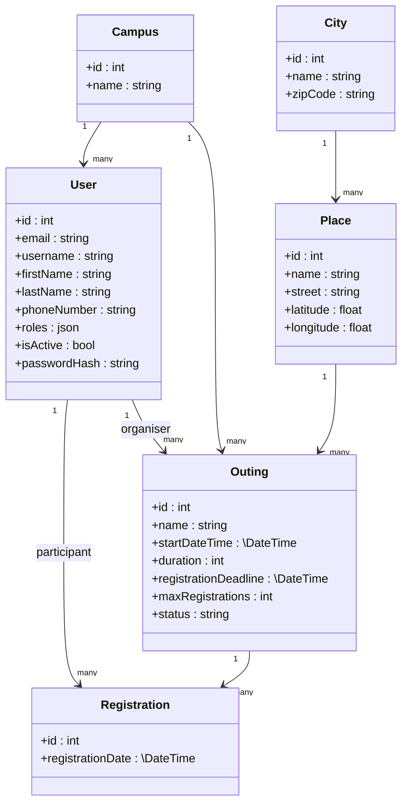
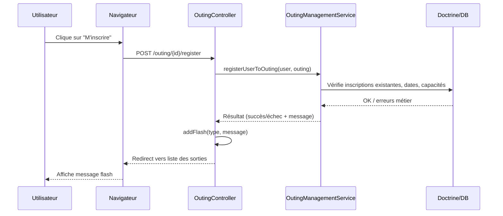

# ENI Connect – Gestion de sorties

ENI Connect est une application Symfony permettant d’organiser, gérer et suivre des sorties entre utilisateurs d’un même campus (étudiants, formateurs, staff).  
Le projet met l’accent sur une **architecture propre**, la **sécurité**, une **UX soignée** et une **gestion avancée des rôles et statuts de sorties**.

---

## 📚 Sommaire

1. [Contexte & objectifs](#-contexte--objectifs)  
2. [Fonctionnalités principales](#-fonctionnalités-principales)  
3. [Stack technique](#-stack-technique)  
4. [Architecture & modèle de données (UML)](#-architecture--modèle-de-données-uml)  
5. [Arborescence du projet](#-arborescence-du-projet)  
6. [Parcours utilisateur](#-parcours-utilisateur)  
7. [Import utilisateurs via CSV](#-import-utilisateurs-via-csv)  
8. [API et sécurité](#-api-et-sécurité)  
9. [Tests](#-tests)  
10. [Contributeurs & répartition des tâches](#-contributeurs--répartition-des-tâches)  
11. [Lancer le projet en local](#-lancer-le-projet-en-local)

---

## 🎯 Contexte & objectifs

Ce projet est réalisé dans le cadre d’un **projet fil rouge** de formation.  
Objectifs pédagogiques principaux :

- Mettre en pratique **Symfony**, **Doctrine**, **Twig** et les bonnes pratiques d’architecture.
- Gérer une application multi‑rôles : **participants**, **organisateurs**, **administrateurs**.
- Implémenter des fonctionnalités **réalistes** : gestion des sorties, filtres, authentification, réinitialisation de mot de passe, import CSV, API, etc.
- Travailler en **équipe** avec Git/GitHub (branches, PR, revues de code).

---

## ✨ Fonctionnalités principales

- **Gestion des utilisateurs**
  - Inscription / connexion via email **ou** username.
  - Profil utilisateur, photo de profil, modification du mot de passe.
  - Rôles : `ROLE_USER`, `ROLE_ORGANIZER`, `ROLE_ADMIN` avec hiérarchie.
  - Administration des utilisateurs (création, édition, activation/désactivation, **suppression conditionnelle**).

- **Gestion des sorties**
  - Liste des sorties avec filtres (campus, dates, états, texte libre…).
  - Création, modification, annulation de sortie (avec formulaires complets).
  - Statuts calculés et mis à jour automatiquement (service `OutingStatusUpdater`).
  - Règles métier (rôles, dates, capacités, inscriptions/désistements).

- **Back‑office administrateur**
  - Pages d’admin pour **utilisateurs**, **villes**, **campus**.
  - Actions groupées (désactiver / supprimer plusieurs utilisateurs).
  - Interface modernisée (cards, palette de couleurs cohérente, tables scrollables).

- **Import utilisateurs via fichier CSV**
  - Upload d’un CSV, prévisualisation des lignes, code couleur des champs manquants.
  - Remplissage automatique des champs vides avec des valeurs par défaut.
  - Validation, vérification des doublons, création en base via Doctrine.

- **Sécurité & authentification**
  - `security.yaml` complet : firewall, accès restreints, remember‑me, logout.
  - `CustomAuthenticator` pour login par email ou username.
  - Intégration de `symfonycasts/reset-password-bundle` avec mails stylés.

- **API sorties**
  - API sécurisée pour lister les sorties avec filtres (états, dates…).
  - Accessible uniquement aux utilisateurs authentifiés.

---

## 🧱 Stack technique

- **Langage** : PHP 8.2+
- **Backend** : Symfony 7.4 (framework principal)
- **Base de données** : MySQL / MariaDB via Doctrine ORM
- **Frontend** : Twig, Bootstrap 5 (AssetMapper), Stimulus (Symfony UX), Symfony UX Turbo
- **Tests** : PHPUnit 11, Zenstruck Foundry, Doctrine Fixtures Bundle, FakerPHP, BrowserKit, CSS Selector
- **Bundles / composants ajoutés** : Doctrine ORM 3.6+, Doctrine Migrations, Doctrine Messenger, Symfony Apache Pack, Monolog Bundle, SymfonyCasts Reset Password Bundle, Twig Extra Bundle, Debug Bundle, Stopwatch, Maker Bundle
- **Outils** : Composer, Symfony CLI, Mailpit, Git / GitHub

---

## 🧩 Architecture & modèle de données (UML)

### Modèle principal (diagramme de classes simplifié)



### Séquence simplifiée : inscription à une sortie



---

## 🌳 Arborescence du projet

Arborescence **simplifiée** (principaux dossiers uniquement) :

```text
eni-connect/
├─ assets/                 # JS/CSS, Stimulus, Webpack/Importmap
├─ bin/                    # Console Symfony
├─ config/                 # Config Symfony & security.yaml
├─ docs/                   # Énoncés, suivi d’équipe, documentation
├─ migrations/             # Migrations Doctrine
├─ public/                 # Document root (index.php, assets compilés)
├─ src/
│  ├─ Controller/
│  │  ├─ Admin/            # Contrôleurs back-office (users, villes, campus…)
│  │  ├─ Api/              # Contrôleur API des sorties
│  │  ├─ Security/         # Login / reset password / authenticator
│  │  └─ ...               # OutingController, OutingManagerController, etc.
│  ├─ Entity/              # Entités Doctrine (User, Outing, Campus, City, Place…)
│  ├─ Repository/          # Requêtes personnalisées (ex: findForApi)
│  ├─ Services/            # Logique métier (UserManager, OutingStatusUpdater…)
│  └─ ...
├─ templates/
│  ├─ admin/               # Vues d’administration
│  ├─ outing/              # Vues sorties (liste, détails, créer, modifier, annuler)
│  ├─ security/            # Vues login, reset password
│  └─ ...
├─ tests/                  # Tests unitaires/fonctionnels
├─ translations/           # Fichiers de traduction
├─ var/                    # Cache / logs
├─ vendor/                 # Dépendances Composer
├─ composer.json
└─ symfony.lock
```

---

## 🧭 Parcours utilisateur

- **Utilisateur connecté (tout rôle)**
  - Accède à la page de **login** (maquette intégrée).
  - Se connecte avec email ou username.
  - Consulte la **liste des sorties**, filtre selon ses besoins.
  - Consulte/édite son **profil** (photo, infos personnelles, mot de passe).
  - Peut **réinitialiser son mot de passe** via un email sécurisé.

- **Organisateur (`ROLE_ORGANIZER`)**
  - Crée une sortie via un **formulaire complet**.
  - Modifie ou annule ses sorties (avec formulaire spécifique et champ “motif d’annulation”).
  - Bénéficie d’une mise à jour automatique des **statuts** des sorties.

- **Administrateur (`ROLE_ADMIN`)**
  - Gère les **villes**, **campus**, **utilisateurs** depuis un menu admin.
  - Ajoute des utilisateurs individuellement ou via **import CSV**.
  - Peut désactiver plusieurs utilisateurs d’un coup et **ne peut supprimer** un utilisateur que s’il n’est rattaché à **aucune sortie** (organisateur ni participant).
  - Dispose d’un **dashboard** avec navigation claire et design retravaillé.

---

## 📥 Import utilisateurs via CSV

Fonctionnalité portée par **Réda** (itération 3 dans le suivi d’équipe) :

- **Fichier CSV source**
  - Exemple de fichier `gestion-utilisateurs.csv` fourni dans la doc.
  - Colonnes : `email`, `username`, `firstName`, `lastName`, `phone`, `campus`, `role`.

- **Étape 1 – Upload & parsing**
  - Formulaire `UserImportType` (upload de fichier + option “ligne d’en‑tête”).
  - Détection automatique du **séparateur** (`;` ou `,`).
  - Lecture du fichier avec `fgetcsv`, remplissage d’un tableau `$rows`.

- **Étape 2 – Prévisualisation & correction**
  - Vue Twig `admin/user_import.html.twig` :
    - Tableau de prévisualisation **éditable**.
    - **Code couleur** :
      - Rouge : champs obligatoires manquants (email, pseudo, prénom, nom).
      - Jaune : champs facultatifs manquants (téléphone, campus, rôle).
    - Options :
      - Champ “mot de passe par défaut”.
      - Case à cocher “remplir automatiquement les champs vides avec des valeurs par défaut”.

- **Étape 3 – Validation & création**
  - Contrôleur `UserAdminController::confirmImportUsers()` :
    - Récupère les lignes modifiées (`rows[...]`).
    - Applique les **valeurs par défaut** si demandé (email/pseudo/nom/role).
    - Vérifie les **doublons** d’email et de username.
    - Tente de résoudre le **campus** par son nom (facultatif).
    - Crée les entités `User`, hash le mot de passe, `persist` + `flush`.
    - Affiche un résumé : `X utilisateurs créés, Y lignes ignorées.`

---

## 🔐 API et sécurité

- **Security / authentification**
  - `CustomAuthenticator` pour login par **email ou username** (Swan).
  - `UserChecker`, `remember_me`, accès restreints par `access_control`.
  - Intégration de `symfonycasts/reset-password-bundle` :
    - Pages Twig de demande, email envoyé, formulaire de nouveau mot de passe.
    - Mails HTML stylés avec logo et messages de sécurité en français.

- **API sorties**
  - `APIOutingController` (Swan) expose une **liste de sorties** consommable en JSON.
  - Méthode `findForApi()` dans `OutingRepository` pour filtrer :
    - par **date**, par **état**,
    - exclusion des statuts “création” et “terminée” selon les règles métier.
  - Firewall configuré pour restreindre l’API aux **utilisateurs authentifiés**.

---

## ✅ Tests

- Mise en place de tests **unitaires, fonctionnels et d’intégration** (William) :
  - PHPUnit + ZenstruckFoundryBundle.
  - Jeux de données générés pour simuler rapidement des utilisateurs/sorties.
- Objectif : sécuriser les règles métier (statuts de sortie, contraintes d’inscription, sécurité).

---

## 👥 Contributeurs & répartition des tâches

D’après le fichier `docs/Suivi équipe WRS - Suivi.csv`.

### William – Chef de projet / Architecte

- **Initialisation & infrastructure**
  - Création de la base de données, du projet Symfony, configuration environnement et Git/GitHub.
  - Ajout de Bootstrap dans le projet, intégration finale (suppression des CDN, configuration propre).
  - Mise en place d’un système de fixtures cohérent et maintenable, piloté par un service central (FixturesDataProvider) garantissant cohérence, réutilisation et génération contrôlée des données.

- **Modèle & services**
  - Création/refactor de plusieurs entités et relations (ex. Campus → Place).
  - Service `OutingStatusUpdater` pour calculer/mettre à jour les statuts de sorties.
  - Refactor de `OutingController` et création d’`OutingManagementService`.
  - Refactor du contrôleur admin via services métier.

- **Qualité & performances**
  - Relectures de code régulières et corrections.
  - Mise en place des tests (unitaires, fonctionnels, intégration).
  - Optimisation des requêtes et du firewall (gains de 200–400 ms sur certaines pages).
  - Remise à niveau de la BDD et clarification des statuts de sortie (3 statuts en BDD, le reste est calculé).

- **Front-end dynamique & UX**
  - Installation et configuration de **Stimulus** dans le projet.
  - Développement du contrôleur **place_controller.js** permettant :
    - la mise à jour dynamique des **villes** et **lieux** en fonction du **campus** sélectionné,
    - une expérience fluide pour les organisateurs lors de la création et modification des sorties,
    - une réduction des erreurs utilisateur et une meilleure cohérence des données.

### Swan – Sécurité, UI/UX, API et reset password

- **Sécurité & authentification**
  - Création de `UserController`, `SecurityController`, `CustomAuthenticator`.
  - Configuration avancée de `security.yaml` (UserChecker, remember‑me, access control, logout).
  - Redirections après connexion/déconnexion, sauvegarde profil.

- **Interfaces utilisateur**
  - Templates : `profil.html.twig`, `show.html.twig`, `login.html.twig`.
  - Intégration des maquettes (login, profil, show, navbar, header, logo).
  - Refonte visuelle globale :
    - Palette Notion (beige/blanc/anthracite/orange).
    - Navbar épurée, footer, tables scrollables.
    - Pages d’admin en **cards** avec hover orange, styles centralisés.

- **Pages sorties & admin**
  - Pages Twig afficher/modifier/annuler une sortie.
  - Gestion des routes publier/modifier/annuler.
  - Page Twig gérer les **utilisateurs** + contrôleur admin et routes.
  - Tri des tableaux (colonnes triables dans plusieurs pages).

- **Reset password & e‑mails**
  - Intégration `symfonycasts/reset-password-bundle`.
  - Configuration Mailer (Mailpit, SMTP, Messenger).
  - Traduction complète en français des templates de reset + formulaires.
  - Création d’un **email HTML stylé** avec logo, bouton sécurisé, messages de sécurité.

- **API**
  - Création de `APIOutingController`.
  - Méthode `findForApi` dans `OutingRepository` pour exposer les sorties avec filtres.

### Réda – Front/Back sorties & admin utilisateurs + import CSV

- **Domaines “sorties” & filtres**
    - Création des entités `Sorties`, `Campus`, `Inscription`, `Lieu`, `Ville` et leurs relations (organisateur / participant).
    - Page **liste des sorties** avec filtres (back + front).
    - Page **créer une sortie** (formulaire complet) et accessibilité des filtres.
    - Ajout des **états de sortie** sur la liste (en lien avec le service de statuts).
    - Annulation de sortie (formulaire avec détails, mises à jour cohérentes).

- **Admin & back-office**
    - Page **menu admin** (boutons vers gestion villes, campus, utilisateurs).
    - Page Twig gérer les **villes** (et routes associées).
    - Page admin **ajouter un utilisateur** (+ `UserType` adapté, choix des rôles).
    - Ajout d’`IsGranted` dans les contrôleurs pour sécuriser l’accès.
    - Messages flash sur la liste des sorties.

- **Import CSV utilisateurs**
    - Conception du **fichier CSV de référence** (Google Sheets) pour les utilisateurs.
    - Formulaire d’upload `UserImportType`, route et contrôleur d’import.
    - Page de **prévisualisation** avec code couleur (obligatoire/facultatif) et légende UX.
    - Second formulaire : options de remplissage automatique, mot de passe par défaut, validation des données.
    - Parsing du CSV, création des utilisateurs, branchement avec la BDD.
    - Bouton “Importer un fichier CSV” sur la page admin utilisateurs.
    - Règle métier : **impossibilité de supprimer un utilisateur inscrit à une sortie** (avec message flash explicite).

- **Documentation**
    - Ajout de doc dans le projet (consignes, maquettes, checklist).

  
### Toute l’équipe

- Réunions de cadrage : analyse du besoin, lecture des énoncés, répartition des tâches, organisation.
- Conception du **diagramme de classes** et validation du modèle.
- Création des entités, contrôleurs, fixtures, configuration sécurité.
- Ajout de la documentation projet (consignes, maquettes, checklist).
- Intégration finale et revue des PRs.

---

## 🚀 Lancer le projet en local

1. **Cloner le dépôt**

```bash
git clone <url-du-repo>
cd eni-connect
```

2. **Installer les dépendances**

```bash
composer install
```

3. **Configurer l’environnement**

- Copier `.env` en `.env.local` et adapter la section `DATABASE_URL`.
- Lancer la base de données (MySQL / MariaDB).

4. **Appliquer les migrations & fixtures (si disponibles)**

```bash
php bin/console doctrine:database:create
php bin/console doctrine:migrations:migrate
php bin/console doctrine:fixtures:load
```

5. **Lancer le serveur Symfony**

```bash
symfony serve
```

6. **Accéder à l’application**

- Front office : `http://localhost:8000`
- Back office admin : `http://localhost:8000/admin` (voir doc/fixtures pour les comptes de test).

---

